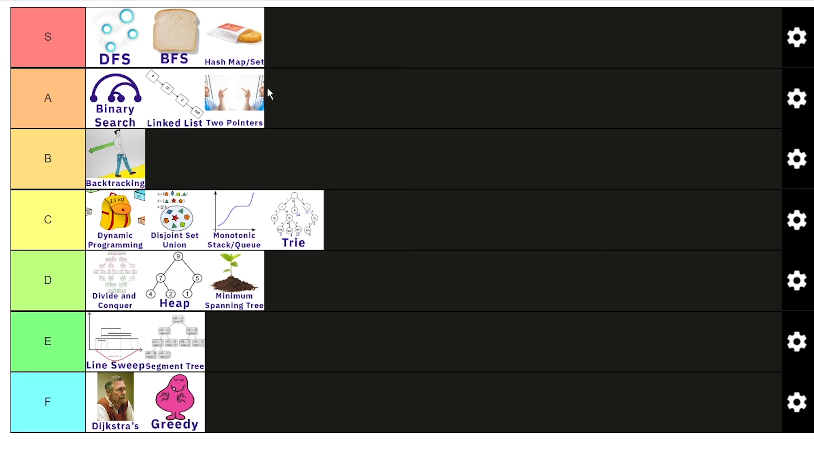

# .png)

        

<!-- Can I add all this data into this svg file above???!, I want to add it. -->

<!-- Add your introduction or personal statement here -->
## 💫 About Me

I am constantly striving to reach new heights in my personal and professional growth. I prioritize self-improvement and love pushing boundaries to achieve excellence.

<!-- Add links to your CV, resume, project details, and skills -->
## 🌐 Socials

<!-- Add your tech stack and skills -->

<!-- Find better icon packs -->
## 💻 Tech Stack

<!-- Add more badges for the technologies you work with -->

<!-- Add your GitHub stats and top languages -->
## 📊 GitHub Stats

<!-- Holopin Stickers -->

<!-- My medium blogs -->
<!-- <a target="_blank" href="https://github-readme-medium-recent-article.vercel.app/medium/@playnitkarsh/0"> 

<a target="_blank" href="https://github-readme-medium-recent-article.vercel.app/medium/@playnitkarsh/1"> 
-->
<!-- Add your project details -->
<!-- ## 🚀 Projects -->
<!-- Add details about your projects, such as descriptions, technologies used, and links to repositories or project pages -->

<!-- Add any additional sections or content you want -->

<!-- Add your own closing message -->
<!--
## Hello

## Hello

## Hello

## Hello

## Hello

## Hello
-->

        

<h1 align='center'>⚡️<i>⚡️Being Pragmatic Is The Way!⚡️</i>⚡️</h1>

<!--

        

--- ;
-->

        

--- 

<!-- Add your https://nitkarshchourasia.github.io/ link to every other clickables. -->

<!-- Use HTML  tag to set the width while maintaining aspect ratio -->

<!-- Add any other text or content below the image -->

<!--### Some Meme's-->

<!-- View count -->

<!-- (Visitor's Count) -->

<!-- End of document -->

<!-- Embed image below from assets directory named "ROI_DSA.png" -->

 My notes section so I can view it n numbers of time to internalise it.

#### Rate of Return?????!!!

#### Return on Investment?????!!!

### To quote Issac Newton, "if I have seen further, it is by standing on the shoulders of Giants." - thus, a __Recursion__

### "Programming is nothing without business" by one of my friend - Kirill Dubovitskiy (bra1nDump)

### The quote that I've fallen in love with: "The magic you are looking for is in the work YOU are avoiding." 

        
Currently Working On:

- To Become God in C++
        
- To Become Mahadev in Python
  
- To become a Hashmap Bender of C# Programming Language in Style
  
- To Become the Almighty in JavaScript, CSS, HTML
  
- Learning Django
  
- Learning Flask
  
- Learning Node.js
  
- Learning Full Stack and Backend
  
- Python Libraries learning (numerous)
  
    - Everything I can get my hands on (Pragmatic)
  
- Machine Learning
  
- Generative AI
  
- Prompt Enginnering
  
- Bots (different kinds)
  
- Creating a library to be published on Pip Install {my_library}

Thank You - If you have read so far.

<!-- Finally End of Document -->

<!-- Made with ❤️ by Nitkarsh -->

 
 

End of README.md

